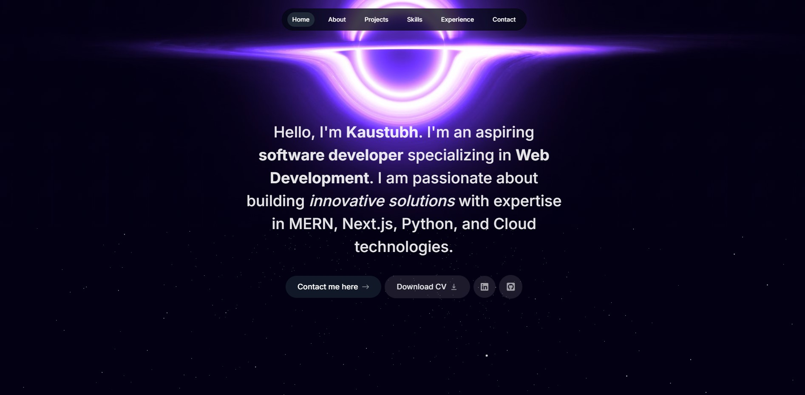
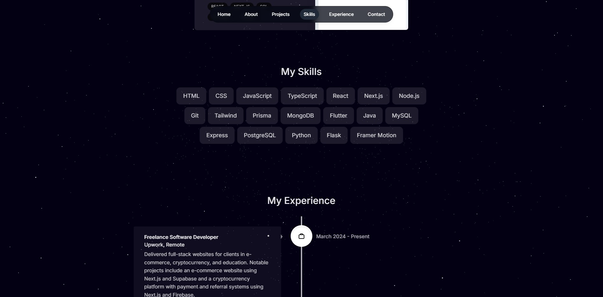
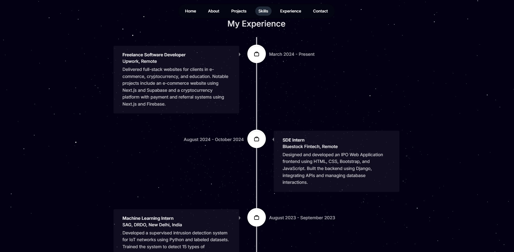

# Kaustubh Tiwari - Personal Portfolio

Welcome to the repository for my personal portfolio! This project showcases my skills, experiences, and projects in a visually appealing and responsive format. It’s built using modern web development technologies, with a focus on performance and design.

## 🖥️ Live Demo

You can view the live version of my portfolio [here](https://kaustubhtiwari.vercel.app).

---

## 📂 Project Structure

The portfolio is organized into the following folders for modularity and maintainability:

```
├── actions/            # Server-side action handlers for sending emails.
├── app/                # Next.js app router structure for routing and pages.
├── components/         # Reusable React components (Hero, Header, Footer, etc.).
├── context/            # Context API for managing global state like active sections.
├── email/              # Component for email-related features (e.g., contact forms).
├── lib/                # Data and helper functions used across the app.
├── node_modules/       # Dependencies installed via npm.
├── public/             # Static assets like images, videos, and fonts.

```

## 🚀 Features

- **Dark-Themed Design**: Aesthetic, modern, and professional look.
- **Responsive Layout**: Optimized for desktop and mobile devices.
- **Interactive Animations**: Engaging landing page animations using videos and particle effects.
- **Dynamic Content**: Custom timeline and project sections that fetch data dynamically.
- **Optimized Performance**: Built with Next.js and Tailwind CSS for fast load times and scalability.

---

## 🛠️ Technologies Used

- **Next.js 14**: For server-side rendering and fast page transitions.
- **Tailwind CSS**: For modern, utility-first styling.
- **shadcn/ui**: For consistent and accessible UI components.
- **React Hot Toast**: For notifications.
- **React Vertical Timeline**: For creating a visually appealing timeline.

---

## ⚙️ Installation and Setup

1. **Clone the repository**:

   ```bash
   git clone https://github.com/StonebanksYT/portfolio-website.git
   cd portfolio-website
   ```

2. **Install dependencies**:

   ```bash
   npm install
   ```

3. **Run the development server**:

   ```bash
   npm run dev
   ```

4. Open your browser and navigate to `http://localhost:3000`.

---

## 📁 Data Structure

Data for sections like experience and projects is managed in the `/lib/data.ts` file. To update or add new content:

1. Open `/lib/data.ts`.
2. Modify the arrays such as `experiencesData`, `projectsData`, etc.

---

## 📸 Screenshots

### Hero Section



### Skills Section



### Experience Timeline



## 🤝 Contact

If you'd like to connect or have any queries, you can reach out to me via:

- Email: kaustubhtiwari2003@gmail.com
- LinkedIn: [linkedin.com/in/kaustubh-tiwari](https://www.linkedin.com/in/kaustubh-tiwari-60a623138)

---

## 📜 License

This project is licensed under the **MIT License**. You are free to use, modify, and distribute it as long as you include the original license.

---

⭐ If you like this project, please give it a star on [GitHub](https://github.com/StonebanksYT/portfolio)!

```

```
